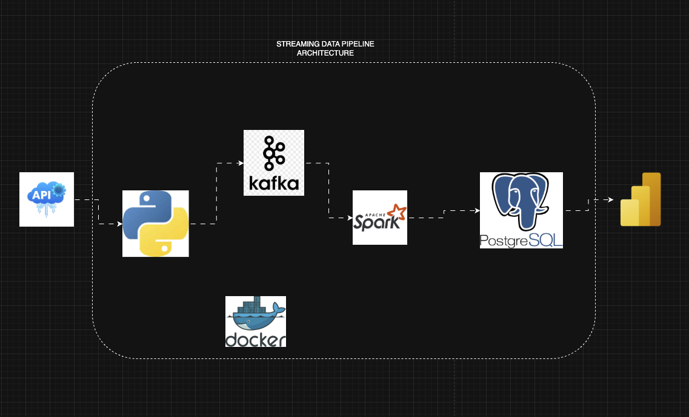

# Real-Time Stock Market Analysis — Data Engineering Project

A data engineering project that builds a production-style streaming pipeline for market data. The solution ingests time-series trade and quote events from the Vantage API, streams them through Apache Kafka, processes them with Apache Spark, and stores analytics-ready records in PostgreSQL. All services are containerized with Docker for repeatable local and cloud deployments.

## Project Overview
This project demonstrates how high-frequency financial market data can be captured, transformed, and prepared for analytics, reporting, and downstream ML. The use case sits in the fintech / capital markets industry where low-latency, accurate time-series data is essential for trading analytics, market surveillance, and risk reporting.

### Data Pipeline Architecture

## Industry Focus
- Fintech / Capital markets
- Trading analytics and market surveillance
- Financial data engineering and real-time analytics

## Data
The pipeline processes time-series market events, typically including:
- timestamp (event time)
- symbol / instrument identifier
- trade price, size (volume)
- bid / ask / quote updates
- exchange / venue, trade id
- derived fields (minute bars, VWAP, rolling aggregates)

This data supports real-time dashboards, aggregated reporting, and ML model inputs.

## Architecture
A streaming-focused data layout:
- Raw (Kafka topics): ingest of JSON events from the API
- Processed (Parquet / Spark output): cleaned and windowed data for analytics
- Curated (PostgreSQL): reporting tables and aggregates for BI and queries

## Tools and Technologies
- Apache Kafka (streaming)
- Apache Spark (stream processing)
- PostgreSQL (storage, reporting)
- Docker & Docker Compose (containerization)
- Kafka UI, pgAdmin (observability / management)
- Optional: Power BI or similar for visualization

## Workflow
1. Ingest market data from the Vantage API into Kafka topics
2. Stream-process events with Spark (transformations, aggregations)
3. Write processed outputs to Parquet and load curated tables into PostgreSQL
4. Connect BI tools to PostgreSQL for dashboards and reporting

## What This Project Shows
- End-to-end streaming architecture (API → Kafka → Spark → Postgres)
- Handling of time-series financial data and low-latency processing
- Containerized, reproducible deployment for development and demos
- Practical considerations: schema design, windowing/aggregation, and observability

## Quick start (local)
1. Install Docker and Docker Compose
2. From the repository root run: docker-compose up -d
3. Inspect Kafka topics via Kafka UI and view tables in pgAdmin

## Repository Purpose
This repo highlights practical data engineering skills for fintech roles: streaming pipelines, time-series processing, containerized deployments, and preparing financial data for analytics and ML.

Contact: open an issue or contact the maintainer for a walkthrough or demo.